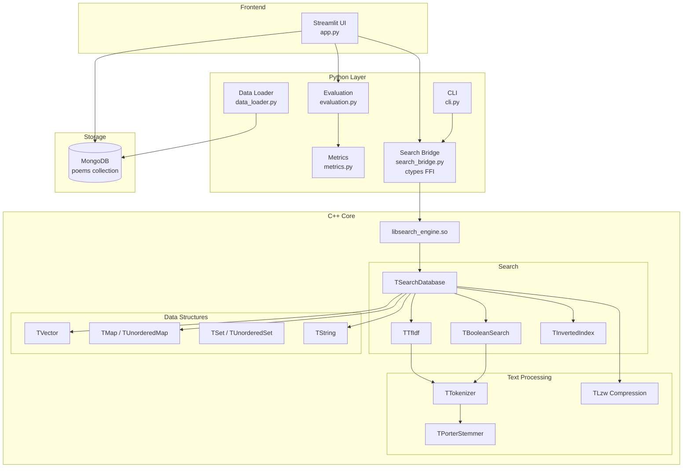

# Poetry Search Engine

Поисковая система по корпусу поэзии для курса "Информационный поиск" МАИ.

## Архитектура



## Реализованные компоненты

### C++ (lib/)

| Компонент | Описание |
|-----------|----------|
| `TVector`, `TList`, `TDeque`, `TQueue`, `THeap` | STL-подобные контейнеры без STL |
| `TUnorderedMap`, `TUnorderedSet` | Хеш-таблицы (Robin Hood) |
| `TMap`, `TSet` | Красно-чёрные деревья |
| `TString` | Строка с SSO и FNV-1a хешем |
| `TTokenizer` | Токенизация текста |
| `TPorterStemmer`, `TLemmatizer` | Стемминг / лемматизация |
| `TInvertedIndex` | Инвертированный индекс |
| `TBooleanSearch` | Булев поиск (AND/OR/NOT) |
| `TTfIdf` | TF-IDF ранжирование |
| `TZipfAnalyzer` | Анализ по закону Ципфа |
| `TLzw` | LZW-сжатие |
| `TSearchDatabase` | Высокоуровневая БД документов |

### Python (server/)

- **app.py** — Streamlit веб-интерфейс с вкладками поиска и метрик
- **cli.py** — CLI утилита (stdin → stdout)
- **search_bridge.py** — ctypes обёртка над C++
- **data_loader.py** — загрузка JSONL в MongoDB и индексацию
- **metrics.py** — реализация метрик качества (P@k, DCG, NDCG, ERR)
- **evaluation.py** — класс SearchEvaluator для оценки качества поиска

## Сборка

### Требования

- CMake 3.14+
- C++17 совместимый компилятор (GCC 8+, Clang 7+, MSVC 2017+)
- Python 3.8+
- MongoDB 4.4+

### Сборка C++ библиотеки

```bash
mkdir build && cd build
cmake ..
cmake --build . -j$(nproc)
```

После сборки библиотека будет доступна по пути `build/search_system/libsearch_engine.so` (Linux) или `libsearch_engine.dylib` (macOS).

### Запуск тестов C++

```bash
cd build
ctest -j4 --output-on-failure
```

### Установка Python зависимостей

```bash
cd server
pip install -r requirements.txt
```

### Запуск приложения локально

1. Запустите MongoDB:
```bash
mongod --dbpath /path/to/data
```

2. Загрузите данные (один раз):
```bash
cd server
python data_loader.py --input ../data/poetry50k.dedup.jsonl
```

3. Запустите Streamlit:
```bash
cd server
LIB_PATH=../build/search_system/libsearch_engine.so streamlit run app.py
```

## Запуск с Docker

```bash
cp ~/Desktop/poetry50k.dedup.jsonl data/

docker-compose up -d

docker-compose run --rm data_loader

# Открыть http://localhost:8501
```

## CLI использование

```bash
echo "eternal love" | python server/cli.py --mode tfidf --top-k 10

echo "love AND heart" | python server/cli.py --mode boolean

python server/cli.py --interactive
```

## Оценка качества поиска

В веб-интерфейсе доступна вкладка **"📊 Метрики"**, которая позволяет:

- Запустить автоматический бенчмарк на синтетических запросах
- Выбрать режим поиска (TF-IDF или Boolean)
- Настроить количество тестовых запросов (5-100)
- Настроить Top-K для оценки (5-200) или оценить все результаты

### Реализованные метрики

#### Precision@k (P@k)
Доля релевантных документов в топ-k выдаче.

$$P@k = \frac{|\text{релевантные документы в топ-}k|}{k}$$

- **Диапазон**: [0, 1]
- **Интерпретация**: P@10 = 0.6 означает, что 6 из 10 документов в выдаче релевантны
- **Когда использовать**: когда важно, чтобы каждый результат был релевантен

#### DCG@k (Discounted Cumulative Gain)
Учитывает не только релевантность, но и позицию документа — более высокие позиции важнее.

$$DCG@k = \sum_{i=1}^{k} \frac{rel_i}{\log_2(i+1)}$$

- **Диапазон**: [0, ∞)
- **Интерпретация**: чем выше, тем лучше. Релевантные документы на первых позициях дают больший вклад
- **Когда использовать**: когда порядок документов важен

#### NDCG@k (Normalized DCG)
DCG, нормализованный относительно идеальной выдачи (когда все релевантные документы на первых позициях).

$$NDCG@k = \frac{DCG@k}{IDCG@k}$$

где IDCG@k — DCG для идеального ранжирования.

- **Диапазон**: [0, 1]
- **Интерпретация**: NDCG@10 = 0.85 означает, что выдача на 85% соответствует идеальной
- **Когда использовать**: для сравнения разных поисковых систем на одних данных

#### ERR@k (Expected Reciprocal Rank)
Вероятностная метрика, моделирующая поведение пользователя: он просматривает результаты сверху вниз и может остановиться на любом релевантном документе.

$$ERR@k = \sum_{i=1}^{k} \frac{1}{i} \prod_{j=1}^{i-1}(1-R_j) \cdot R_i$$

где $R_i = \frac{2^{rel_i}-1}{2^{max\_grade}}$ — вероятность удовлетворения пользователя документом на позиции i.

- **Диапазон**: [0, 1]
- **Интерпретация**: учитывает, что пользователь прекращает поиск после нахождения релевантного документа
- **Когда использовать**: когда моделируется реальное поведение пользователя

### Визуализация результатов

- **Таблица** с усредненными метриками по всем запросам для выбранных значений k
- **Интерактивные графики Plotly**:
  - Основной график: P, NDCG, ERR по всем значениям k
  - Отдельный график для DCG (имеет другой масштаб)
  - Распределение метрик по запросам с цветовой шкалой
- **Детальные результаты** по каждому запросу с возможностью выбора количества отображаемых запросов

### Запуск бенчмарка

1. Перейдите на вкладку **"📊 Метрики"**
2. Настройте параметры:
   - Режим поиска (tfidf/boolean)
   - Количество синтетических запросов (по умолчанию 50)
   - Top-K для оценки (по умолчанию 50)
3. Нажмите **"🚀 Запустить бенчмарк"**
4. Результаты отобразятся в виде таблиц и графиков

## Требования лабораторной

- [x] 🔴 Токенизация
- [x] 🔴 Стемминг
- [x] 🟢 Лемматизация
- [x] 🔴 Закон Ципфа
- [x] 🔴 Булев индекс
- [x] 🔴 Булев поиск
- [x] 🟡 TF-IDF
- [x] 🟡 Сжатие (LZW)
- [x] 🟡 Автотесты (288 юнит-тестов)

## Датасет

**Poetry 50K**: https://ciir.cs.umass.edu/downloads/poetry/

570,930 уникальных стихотворений на английском языке.
